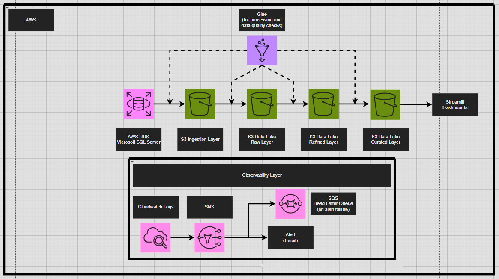
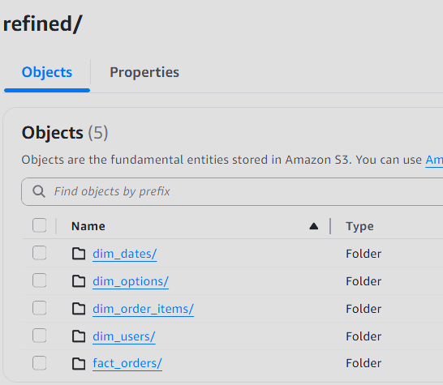
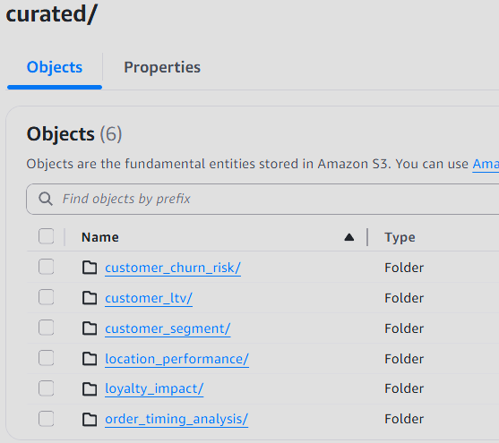
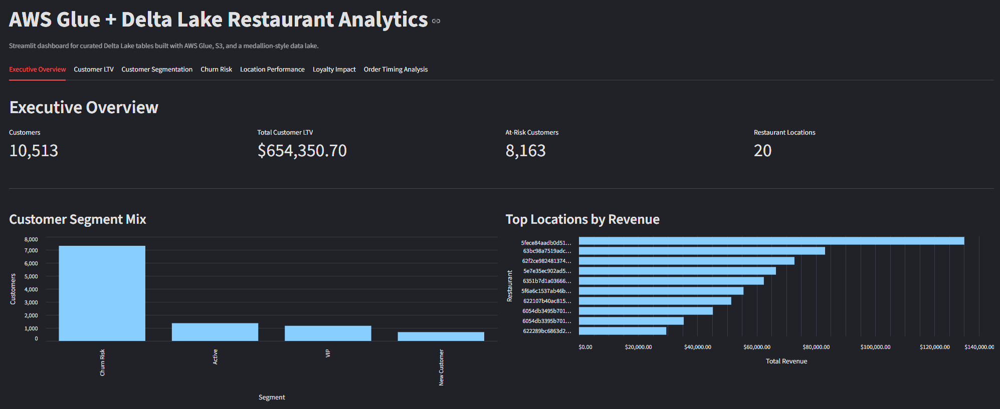
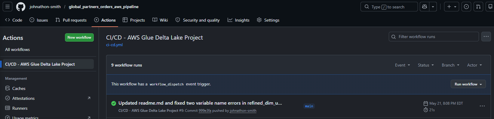

# AWS Glue + Delta Lake Analytics Pipeline


## Overview

This project is an end-to-end AWS data engineering pipeline that ingests restaurant order data from **Microsoft SQL Server on AWS RDS**, processes it through a medallion-style **S3 Delta Lake**, and serves curated analytics through a **Streamlit Cloud dashboard**.

The pipeline is designed to demonstrate practical, production-aware data engineering skills while staying focused enough for a portfolio project. It includes batch ingestion, Delta Lake table management, dimensional modeling, SCD Type 2 logic, curated analytics tables, dashboard consumption, observability, alerting, and CI/CD deployment for AWS Glue scripts.

The final system includes:

* AWS RDS SQL Server as the source system
* AWS Glue Workflow for orchestration and scheduling
* AWS Glue Spark jobs for ingestion and transformations
* Amazon S3 as the data lake
* Delta Lake for raw, refined, and curated table storage
* SCD Type 2 user dimension tracking loyalty changes over time
* Curated analytics tables for customer, churn, loyalty, location, and timing analysis
* Streamlit Cloud dashboard reading curated Delta tables directly from S3
* CloudWatch logging and metrics
* EventBridge failure detection
* SNS email alerts
* SQS dead-letter queue for failed alert delivery
* GitHub Actions CI/CD with Ruff validation and S3 script deployment
* GitHub OIDC authentication with a least-privilege AWS IAM role

---

## Table of Contents

* [Architecture](#architecture)
* [Business Problem](#business-problem)
* [Tech Stack](#tech-stack)
* [Data Pipeline Flow](#data-pipeline-flow)
* [Source Data](#source-data)
* [Data Lake Design](#data-lake-design)
* [Refined Data Model](#refined-data-model)
* [Curated Analytics Layer](#curated-analytics-layer)
* [Streamlit Dashboard](#streamlit-dashboard)
* [Observability and Alerting](#observability-and-alerting)
* [CI/CD Implementation](#cicd-implementation)
* [Repository Structure](#repository-structure)
* [Key Engineering Decisions](#key-engineering-decisions)
* [Security Notes](#security-notes)
* [Interview Talking Points](#interview-talking-points)
* [Future Improvements](#future-improvements)

---

## Architecture



The project uses AWS Glue Workflow as the central orchestrator. Glue jobs extract data from SQL Server, write ingestion files to S3, convert those files into Delta Lake raw tables, transform the data into refined fact and dimension tables, and then create dashboard-ready curated analytical tables.

High-level flow:

```text
AWS RDS SQL Server
        ↓
AWS Glue Workflow
        ↓
Glue Ingestion Jobs
        ↓
S3 Ingestion Layer - Parquet
        ↓
Glue Raw Jobs
        ↓
S3 Raw Layer - Delta Lake
        ↓
Glue Refined Jobs
        ↓
S3 Refined Layer - Delta Lake
        ↓
Glue Curated Jobs
        ↓
S3 Curated Layer - Delta Lake
        ↓
Streamlit Cloud Dashboard
```

Supporting production-style components:

```text
CloudWatch Logs and Metrics
EventBridge Glue failure detection
SNS email alerts
SQS dead-letter queue for failed alert delivery
GitHub Actions CI/CD
GitHub OIDC AWS deployment role
```

Important architecture clarification:

Glue Workflow handles pipeline orchestration and scheduling. EventBridge is not used to schedule or orchestrate the data pipeline. EventBridge is only used as an observability component that listens for failed Glue job state changes and routes those events to SNS.

---

## Business Problem

The source system contains restaurant order activity, customer loyalty information, item-level order details, option/customization data, and calendar metadata. The goal is to transform this operational data into analytics-ready tables that can answer questions such as:

* Which customers generate the most lifetime value?
* Which customers are VIPs, active, new, or at risk of churn?
* Which customers have not ordered recently?
* Which restaurant locations generate the most revenue?
* Do loyalty-associated orders behave differently from non-loyalty orders?
* Which dayparts, weekends, weekdays, and holidays perform best?

Instead of putting heavy business logic directly inside the dashboard, this project precomputes curated analytical tables in AWS Glue. This keeps the Streamlit app lightweight and makes the business logic easier to validate.

---

## Tech Stack

| Area                  | Technology                       |
| --------------------- | -------------------------------- |
| Source Database       | AWS RDS for Microsoft SQL Server |
| Orchestration         | AWS Glue Workflow                |
| Processing            | AWS Glue Spark Jobs, PySpark     |
| Storage               | Amazon S3                        |
| Table Format          | Delta Lake                       |
| Dashboard             | Streamlit Cloud                  |
| Dashboard Data Access | deltalake, pyarrow, pandas       |
| Visualization         | Streamlit, Altair                |
| Logging               | Amazon CloudWatch Logs           |
| Failure Detection     | Amazon EventBridge               |
| Alerts                | Amazon SNS                       |
| Alert DLQ             | Amazon SQS                       |
| CI/CD                 | GitHub Actions                   |
| Code Quality          | Ruff                             |
| AWS Auth for CI/CD    | GitHub OIDC + IAM Role           |

---

## Data Pipeline Flow

### 1. Ingestion Layer

Glue ingestion jobs connect to SQL Server on AWS RDS using JDBC and extract the source tables into S3 as Parquet files.

Source tables:

```text
date_dim
order_items
order_item_options
```

Ingestion layer paths:

```text
s3://global-partners-data-bucket-001/ingestion/date_dim/
s3://global-partners-data-bucket-001/ingestion/order_items/
s3://global-partners-data-bucket-001/ingestion/order_item_options/
```

The ingestion layer is the landing zone for source extracts.

---

### 2. Raw Layer

Raw Glue jobs convert ingestion Parquet files into Delta Lake tables while keeping the data close to the original source structure.

Raw layer paths:

```text
s3://global-partners-data-bucket-001/raw/date_dim/
s3://global-partners-data-bucket-001/raw/order_items/
s3://global-partners-data-bucket-001/raw/order_item_options/
```

Raw tables use Delta Lake format and include Delta transaction logs under `_delta_log/`.

Raw write pattern:

```text
append
```

Raw metadata columns include:

```text
load_dts
```

---

### 3. Refined Layer

The refined layer transforms raw source-aligned data into clean analytical fact and dimension tables.

Refined layer paths:

```text
s3://global-partners-data-bucket-001/refined/fact_orders/
s3://global-partners-data-bucket-001/refined/dim_dates/
s3://global-partners-data-bucket-001/refined/dim_users/
s3://global-partners-data-bucket-001/refined/dim_order_items/
s3://global-partners-data-bucket-001/refined/dim_options/
```

The refined layer applies:

* 2023 filtering
* column casting
* field standardization
* dimensional modeling
* Delta Lake merge/upsert logic
* SCD Type 2 logic for `dim_users`
* point-in-time `user_sk` lookup for `fact_orders`

---

### 4. Curated Layer

The curated layer turns refined fact and dimension data into dashboard-ready analytical tables.

Curated layer paths:

```text
s3://global-partners-data-bucket-001/curated/customer_ltv/
s3://global-partners-data-bucket-001/curated/customer_segmentation/
s3://global-partners-data-bucket-001/curated/churn_risk/
s3://global-partners-data-bucket-001/curated/location_performance/
s3://global-partners-data-bucket-001/curated/loyalty_impact/
s3://global-partners-data-bucket-001/curated/order_timing_analysis/
```

These tables are read directly by the Streamlit dashboard.

---

## Source Data

The source system contains three SQL Server tables.

### `date_dim`

Calendar dimension data for every day of 2023.

| Column         | Description                         |
| -------------- | ----------------------------------- |
| `date_key`     | Full calendar date                  |
| `day_of_week`  | Day of the week                     |
| `week`         | Week number in the year             |
| `month`        | Month name                          |
| `year`         | Calendar year                       |
| `is_weekend`   | Whether the date falls on a weekend |
| `is_holiday`   | Whether the date is a holiday       |
| `holiday_name` | Name of the holiday, if applicable  |

---

### `order_items`

Food order line item data. The source table spans multiple years, but this project processes 2023 records.

| Column                | Description                             |
| --------------------- | --------------------------------------- |
| `app_name`            | Ordering platform or channel            |
| `restaurant_id`       | Restaurant/location identifier          |
| `creation_time_utc`   | Order timestamp in UTC                  |
| `order_id`            | Unique order identifier                 |
| `user_id`             | Customer identifier                     |
| `printed_card_number` | Tokenized or masked loyalty card number |
| `is_loyalty`          | Loyalty membership flag                 |
| `currency`            | Transaction currency                    |
| `lineitem_id`         | Unique order line item identifier       |
| `item_category`       | Item category                           |
| `item_name`           | Item name                               |
| `item_price`          | Item price                              |
| `item_quantity`       | Quantity ordered                        |

Important business logic note:

For this project, `order_total` is calculated as:

```text
sum(item_price) grouped by order_id
```

If `item_price` were later confirmed to represent a unit price instead of a line-item amount, the more accurate formula may become:

```text
sum(item_price * item_quantity)
```

---

### `order_item_options`

Option/customization data tied to order line items.

| Column              | Description                          |
| ------------------- | ------------------------------------ |
| `order_id`          | Parent order identifier              |
| `lineitem_id`       | Parent line item identifier          |
| `option_group_name` | Option group/category                |
| `option_name`       | Selected option                      |
| `option_price`      | Option price                         |
| `option_quantity`   | Number of times the option was added |

---

## Data Lake Design

Final S3 data lake structure:

```text
s3://global-partners-data-bucket-001/
  ingestion/
    date_dim/
    order_items/
    order_item_options/

  raw/
    date_dim/
    order_items/
    order_item_options/

  refined/
    fact_orders/
    dim_dates/
    dim_users/
    dim_order_items/
    dim_options/

  curated/
    customer_ltv/
    customer_segmentation/
    churn_risk/
    location_performance/
    loyalty_impact/
    order_timing_analysis/

  quarantine/

  scripts/
    glue_jobs/
      ingestion/
      raw/
      refined/
      curated/
```

Layer summary:

| Layer      | Format     | Purpose                                             |
| ---------- | ---------- | --------------------------------------------------- |
| Ingestion  | Parquet    | Landing zone for source extracts                    |
| Raw        | Delta Lake | Source-aligned Delta tables with ingestion metadata |
| Refined    | Delta Lake | Clean fact and dimension tables                     |
| Curated    | Delta Lake | Dashboard-ready analytical tables                   |
| Quarantine | Reserved   | Location for invalid/problem records                |
| Scripts    | Python     | Glue scripts deployed by GitHub Actions             |

---

## Refined Data Model



The refined layer contains one main fact table and four supporting dimension/detail tables.

```text
fact_orders
dim_dates
dim_users
dim_order_items
dim_options
```

---

### `fact_orders`

Main order-level fact table.

Grain:

```text
One row per order_id
```

Fields:

```text
app_name
restaurant_id
order_id
user_sk
user_id
order_date
order_timestamp
order_total
num_unique_lineitems
num_order_items
currency
order_year
order_month
etl_updated_at
```

Key logic:

* Aggregates `order_items` to one row per order
* Calculates `order_total` as `sum(item_price)` by `order_id`
* Calculates item counts and quantities
* Joins to `dim_users` to retrieve the correct point-in-time `user_sk`
* Partitioned by `order_year` and `order_month`

Merge key:

```text
order_id
```

---

### `dim_users`

SCD Type 2 user dimension that tracks loyalty attribute changes over time.

Grain:

```text
One row per user version
```

Fields:

```text
user_sk
user_id
printed_card_number
is_loyalty
effective_start_date
effective_end_date
is_current
record_hash
etl_updated_at
```

SCD2 tracked fields:

```text
printed_card_number
is_loyalty
```

Why SCD Type 2 is used:

The source data showed that loyalty fields can change for the same `user_id`. The pipeline preserves historical loyalty status so downstream analytics can answer point-in-time questions such as:

```text
Was this customer a loyalty member at the time of this order?
```

Surrogate key logic:

```text
user_sk = hash(user_id + effective_start_date + record_hash)
```

---

### `dim_dates`

Calendar dimension for 2023.

Grain:

```text
One row per date
```

Fields:

```text
date_key
day_of_week
week
month
year
is_weekend
is_holiday
holiday_name
etl_updated_at
```

Merge key:

```text
date_key
```

---

### `dim_order_items`

Line-item detail table connected to the order-level fact table.

Grain:

```text
One row per order_id + lineitem_id
```

Fields:

```text
order_id
lineitem_id
item_category
item_name
item_price
item_quantity
etl_updated_at
```

Merge key:

```text
order_id + lineitem_id
```

---

### `dim_options`

Option/customization detail table for order line items.

Grain:

```text
One row per selected option/customization for a line item
```

Fields:

```text
order_id
lineitem_id
option_group_name
option_name
option_price
option_quantity
etl_updated_at
```

Merge key:

```text
order_id + lineitem_id + option_group_name + option_name
```

---

## Curated Analytics Layer



The curated layer contains six dashboard-ready analytical Delta tables.

```text
customer_ltv
customer_segmentation
churn_risk
location_performance
loyalty_impact
order_timing_analysis
```

---

### `customer_ltv`

Purpose:

Analyze lifetime customer value.

Grain:

```text
One row per user_id
```

Fields:

```text
user_id
ltv
ltv_category
num_orders
avg_order_value
etl_updated_at
pipeline_run_id
```

Business logic:

```text
ltv = sum(order_total)
num_orders = count distinct order_id
avg_order_value = average order_total
```

LTV category logic:

```text
Top 20% by LTV = High
Middle 60% by LTV = Medium
Bottom 20% by LTV = Low
```

---

### `customer_segmentation`

Purpose:

Segment customers using recency, frequency, and monetary behavior.

Grain:

```text
One row per user_id
```

Fields:

```text
user_id
days_since_last_order
num_orders_last_3_months
total_spend_last_3_months
segment
etl_updated_at
pipeline_run_id
```

Segment labels:

```text
VIP
New Customer
Churn Risk
Active
```

Because the dataset is historical, the analysis anchor date is the max `order_date` in `fact_orders`, not the real current date.

---

### `churn_risk`

Purpose:

Identify customers who may be at risk based on inactivity and spend changes.

Grain:

```text
One row per user_id
```

Fields:

```text
user_id
days_since_last_order
avg_days_between_orders
percent_change_in_spend
at_risk
etl_updated_at
pipeline_run_id
```

At-risk logic:

```text
at_risk = true when days_since_last_order >= 45
```

Percent change in spend compares the most recent rolling 90-day period to the previous rolling 90-day period.

---

### `location_performance`

Purpose:

Analyze restaurant/location performance.

Grain:

```text
One row per restaurant_id for the full analysis period
```

Fields:

```text
restaurant_id
total_revenue
avg_order_value
avg_orders_per_day
avg_orders_per_week
revenue_rank
etl_updated_at
pipeline_run_id
```

Revenue ranking uses `dense_rank()` so tied restaurants do not create gaps in rank values.

---

### `loyalty_impact`

Purpose:

Compare purchasing behavior between loyalty and non-loyalty activity.

Grain:

```text
One row per is_loyalty value
```

Fields:

```text
is_loyalty
customer_count
total_orders
total_revenue
avg_ltv
avg_order_value
avg_orders_per_customer
revenue_per_customer
etl_updated_at
pipeline_run_id
```

This table joins:

```text
fact_orders.user_sk = dim_users.user_sk
```

This allows the dashboard to compare loyalty status at the time of the order using the SCD Type 2 user dimension.

Important caveat:

This table shows correlation between loyalty status and purchasing behavior. It does not prove the loyalty program caused higher spending.

---

### `order_timing_analysis`

Purpose:

Analyze order behavior by date and time-of-day segment.

Grain:

```text
One row per order_date + daypart
```

Fields:

```text
order_date
order_year
order_month
day_of_week
month
is_weekend
is_holiday
holiday_name
daypart
total_orders
total_revenue
avg_order_value
unique_customers
etl_updated_at
pipeline_run_id
```

Daypart logic:

```text
Morning: 6:00 AM - 10:59 AM
Lunch: 11:00 AM - 1:59 PM
Afternoon: 2:00 PM - 4:59 PM
Dinner: 5:00 PM - 8:59 PM
Late Night: 9:00 PM - 5:59 AM
```

Partitioning:

```text
order_year
order_month
```

---

## Streamlit Dashboard



The Streamlit dashboard is deployed to Streamlit Cloud and reads curated Delta tables directly from S3 using the `deltalake` package.

Dashboard tabs:

```text
Executive Overview
Customer LTV
Customer Segmentation
Churn Risk
Location Performance
Loyalty Impact
Order Timing Analysis
```

The app uses Streamlit secrets for AWS credentials and Delta table paths.

Example Delta reading pattern:

```python
from deltalake import DeltaTable

delta_table = DeltaTable(table_path, storage_options=storage_options)
df = delta_table.to_pandas()
```

A global helper converts `decimal.Decimal` columns to `float64` after loading each Delta table. This fixed Altair chart rendering issues caused by Decimal values from Delta Lake.

Dashboard screenshots:

| Tab                   | Screenshot                                        |
| --------------------- | ------------------------------------------------- |
| Executive Overview    | `docs/images/streamlit/executive-overview.png`    |
| Customer LTV          | `docs/images/streamlit/customer-ltv.png`          |
| Customer Segmentation | `docs/images/streamlit/customer-segmentation.png` |
| Churn Risk            | `docs/images/streamlit/churn-risk.png`            |
| Location Performance  | `docs/images/streamlit/location-performance.png`  |
| Loyalty Impact        | `docs/images/streamlit/loyalty-impact.png`        |
| Order Timing Analysis | `docs/images/streamlit/order-timing-analysis.png` |

---

## Observability and Alerting

The project includes a production-aware observability layer.

Observability flow:

```text
AWS Glue Jobs
        ↓
CloudWatch Logs and Metrics

Glue Job State Change Event
        ↓
EventBridge Rule
        ↓
SNS Topic
        ↓
Email Subscription
        ↓ if alert delivery fails
SQS Dead-Letter Queue
        ↓
CloudWatch Alarm on DLQ Messages
```

Components:

| Component        | Purpose                                                    |
| ---------------- | ---------------------------------------------------------- |
| CloudWatch Logs  | Stores Glue job output, driver, executor, and system logs  |
| EventBridge      | Detects Glue job `FAILED`, `TIMEOUT`, and `STOPPED` states |
| SNS              | Sends email alerts for failed Glue jobs                    |
| SQS DLQ          | Captures failed SNS alert deliveries                       |
| CloudWatch Alarm | Alerts when messages accumulate in the DLQ                 |

EventBridge event pattern:

```json
{
  "source": ["aws.glue"],
  "detail-type": ["Glue Job State Change"],
  "detail": {
    "state": ["FAILED", "TIMEOUT", "STOPPED"]
  }
}
```

The alerting path was tested by intentionally failing a Glue job. The failed job wrote logs to CloudWatch, EventBridge detected the failure, SNS sent an email alert, and the job was fixed and rerun successfully afterward.

---

## CI/CD Implementation



The project uses GitHub Actions for lightweight CI/CD.

CI/CD flow:

```text
GitHub Repository
        ↓
GitHub Actions Workflow
        ↓
Validate Python Code with Ruff
        ↓
Deploy Glue Scripts to S3
        ↓
AWS Glue Jobs Use Updated Scripts
```

Workflow behavior:

| Trigger                  | Behavior                                                      |
| ------------------------ | ------------------------------------------------------------- |
| Pull request to `main`   | Run Python validation only                                    |
| Push to `main`           | Run validation, then deploy Glue scripts if validation passes |
| Manual workflow dispatch | Allows controlled force deploy when `force_deploy=true`       |

Glue scripts are deployed to:

```text
s3://global-partners-data-bucket-001/scripts/glue_jobs/
```

The workflow uses GitHub OIDC to assume a least-privilege AWS IAM role. This avoids storing long-term AWS access keys in GitHub Secrets.

The IAM deployment role can only modify objects under:

```text
s3://global-partners-data-bucket-001/scripts/glue_jobs/*
```

It does not have access to RDS, Glue job execution, raw data, refined data, curated data, quarantine data, or administrator actions.

---

## Repository Structure

```text
aws-glue-delta-lake-analytics-pipeline/
│
├── glue_jobs/
│   ├── ingestion/
│   │   ├── ingestion_date_dim.py
│   │   ├── ingestion_order_items.py
│   │   └── ingestion_order_item_options.py
│   │
│   ├── raw/
│   │   ├── raw_date_dim.py
│   │   ├── raw_order_items.py
│   │   └── raw_order_item_options.py
│   │
│   ├── refined/
│   │   ├── refined_dim_dates.py
│   │   ├── refined_dim_users.py
│   │   ├── refined_dim_order_items.py
│   │   ├── refined_dim_options.py
│   │   └── refined_fact_orders.py
│   │
│   └── curated/
│       ├── curated_customer_ltv.py
│       ├── curated_customer_segmentation.py
│       ├── curated_churn_risk.py
│       ├── curated_location_performance.py
│       ├── curated_loyalty_impact.py
│       └── curated_order_timing_analysis.py
│
├── streamlit_app/
│   ├── app.py
│   ├── requirements.txt
│   ├── runtime.txt
│   ├── secrets.example.toml
│   └── .streamlit/
│       └── config.toml
│
├── docs/
│   └── images/
│       ├── architecture/
│       ├── data-model/
│       ├── s3/
│       ├── glue/
│       ├── streamlit/
│       ├── observability/
│       └── cicd/
│
├── .github/
│   └── workflows/
│       └── ci-cd.yml
│
├── requirements-dev.txt
├── pyproject.toml
├── README.md
└── .gitignore
```

---

## Key Engineering Decisions

### Why AWS Glue Workflow instead of Step Functions?

Glue Workflow is sufficient for this batch pipeline because all major processing tasks are AWS Glue jobs. It keeps orchestration and scheduling simple while avoiding unnecessary infrastructure. Step Functions would provide more granular workflow control in a larger production system, but for this portfolio project Glue Workflow is the better fit.

---

### Why Delta Lake?

Delta Lake provides transaction logs, reliable table storage on S3, and merge/upsert support. This is important for the refined and curated layers because those tables need to insert new records and update existing records without blindly appending duplicates.

---

### Why append in raw and merge in refined/curated?

The raw layer preserves source-aligned ingested records, so it uses append. The refined and curated layers represent clean analytical entities, so they use Delta merge/upsert logic based on stable business keys.

---

### Why SCD Type 2 for `dim_users`?

The source data showed that loyalty attributes can change for the same user. SCD Type 2 preserves historical user versions and allows the fact table to join each order to the correct user loyalty status at the time of purchase.

---

### Why keep both `user_sk` and `user_id` in `fact_orders`?

`user_sk` is the dimensional foreign key used to join to the correct SCD Type 2 user version. `user_id` is retained as the source-system natural key for traceability, validation, debugging, and lineage.

---

### Why GitHub Actions instead of AWS CodePipeline?

The CI/CD requirement is lightweight: validate Python code and upload Glue scripts to S3. GitHub Actions keeps the workflow close to the repository, avoids unnecessary AWS infrastructure, and still supports secure AWS authentication through GitHub OIDC and a least-privilege IAM role.

---

### Why EventBridge if Glue Workflow is the orchestrator?

EventBridge is not used for orchestration or scheduling. Glue Workflow remains the orchestrator. EventBridge is only used for observability because AWS Glue emits job state change events, and EventBridge is a clean way to route failed job events to SNS for alerting.

---

## Security Notes

This project uses several security-conscious practices:

* AWS credentials are not committed to GitHub
* Streamlit Cloud credentials are stored in Streamlit secrets
* Streamlit uses a dedicated IAM user with read-only access to the curated S3 prefix
* GitHub Actions uses OIDC instead of long-term AWS access keys
* The GitHub Actions deployment role is limited to the S3 Glue script prefix
* The CI/CD role cannot access raw, refined, curated, RDS, or Glue execution resources
* SNS alert delivery failures are captured in an SQS dead-letter queue

Example Streamlit IAM scope:

```text
s3://global-partners-data-bucket-001/curated/*
```

Example GitHub Actions IAM scope:

```text
s3://global-partners-data-bucket-001/scripts/glue_jobs/*
```

---

## Interview Talking Points

### Full project pitch

I built an end-to-end AWS data engineering pipeline that extracts restaurant order data from SQL Server on AWS RDS, lands it in an S3 ingestion layer, converts it into Delta Lake format in a raw layer, and transforms it into refined fact and dimension tables using AWS Glue jobs orchestrated by AWS Glue Workflow. The refined layer includes an SCD Type 2 `dim_users` table to preserve historical loyalty status, and `fact_orders` stores the correct user surrogate key for point-in-time analysis. I then built a curated analytics layer with customer LTV, segmentation, churn risk, location performance, loyalty impact, and order timing analysis tables. Finally, I deployed a Streamlit Cloud dashboard that reads curated Delta tables directly from S3 and visualizes customer, location, loyalty, churn, and time-based business metrics. I also added CloudWatch, EventBridge, SNS, SQS observability and GitHub Actions CI/CD to make the project more production-aware.

### Observability pitch

I added an observability layer around the Glue pipeline without changing the orchestration design. Glue Workflow still handles orchestration and scheduling, while CloudWatch stores logs and metrics for each job. EventBridge listens for Glue job state changes and routes failed, timed-out, or stopped jobs to SNS for email alerts. I also configured an SQS dead-letter queue for failed SNS alert delivery.

### CI/CD pitch

I added a lightweight CI/CD pipeline with GitHub Actions. Pull requests and pushes run Python validation with Ruff, and pushes to main deploy the Glue job scripts to S3. The Glue jobs reference those S3 script paths, so deploying updated files updates the code used by the jobs. I used GitHub OIDC with a least-privilege AWS IAM role instead of storing long-term AWS access keys in GitHub.

---

## Future Improvements

Potential improvements for a future production version:

* Add Infrastructure as Code with Terraform or AWS CDK
* Add automated Glue job definition deployment instead of manually configured Glue jobs
* Add data quality checks for required fields, duplicate keys, and invalid values
* Add structured quarantine handling for rejected records
* Add unit tests for transformation logic where practical
* Add integration tests against small sample datasets
* Add table-level data freshness checks
* Add cost monitoring for Glue, S3, and Streamlit usage
* Add dashboard-level authentication for non-public deployments
* Add a cached Parquet export fallback for Streamlit if direct Delta reads become slow

---

## Project Status

This project is complete.

Completed components:

* SQL Server source setup
* Glue Workflow orchestration and scheduling
* S3 ingestion layer
* Raw Delta Lake layer
* Refined fact and dimension model
* SCD Type 2 `dim_users`
* Curated analytics layer
* Streamlit Cloud dashboard
* CloudWatch logging
* EventBridge failure detection
* SNS email alerts
* SQS alert dead-letter queue
* CloudWatch DLQ alarm
* GitHub Actions CI/CD
* GitHub OIDC deployment role
* Ruff validation
* Manual force-deploy path
